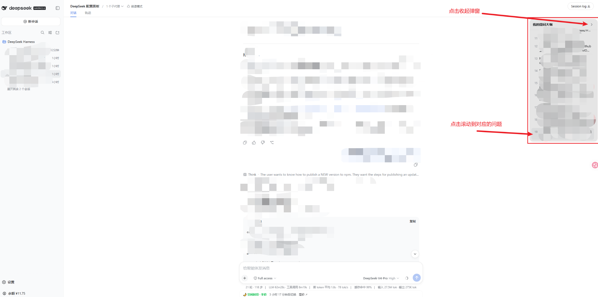
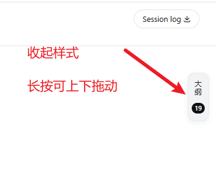

# dsh-my-questions-outline

一个 [DeepSeek Harness (DSH)](https://github.com/deepseek-ai/deepseek-harness) 的 Web 插件：在聊天界面最右侧显示一个**「我的提问大纲」**侧边栏，自动收集当前会话里「我」提出的问题与插话，并提供定位跳转与本地持久化。

---

## 效果

- **默认展开**：进入页面即展开为 ~288px 宽的面板，标题「我的提问大纲」，按时间顺序（旧 → 新）列出我问过的所有问题/插话；可点右上角 `›` 收起为 ~36px 竖条。竖条/面板标题栏**可拖动**调整上下位置（记住上次位置）。
- **条目摘要**：每条最多显示**两行**，超出自动省略（`…`）；鼠标悬停显示完整内容。
- **点击定位**：点击任一条目，页面平滑滚动到对应消息并高亮约 2.5 秒。
- **自动更新**：发送新问题后，大纲实时追加。
- **本地持久化**：曾经加载/见到过的提问会按会话存到 `localStorage`；即使后来被分页顶出 DOM（长会话「加载更早」场景），大纲里依然保留。
- **未加载标记**：那些「已持久化、但当前不在页面里」的历史提问，会在条目右侧显示一个灰色「**未加载**」徽标并淡化文字，提示你需要先点「加载更早」；悬停有完整说明。
- **点击未加载的历史提问**：若目标已被分页顶出 DOM，会滚到会话顶部（露出最早的已加载内容与「加载更早」按钮），由你手动点「加载更早」继续——不程序化点击按钮，避免干扰 DSH 自身的分页。
- **会话隔离**：切换会话或刷新页面后，重新识别当前会话，不残留旧会话数据。





> 说明：本插件**不修改**聊天布局、不改变消息顺序、**不向消息流注入任何额外 DOM**——侧边栏通过官方 `shell.overlay` 槽以固定定位渲染在视口右侧。

---

## 前置条件

- 已安装并运行 DeepSeek Harness（Web 版）。
- 无需 API Key，纯客户端运行。

---

## 安装

### 方式一：从 npm 安装（推荐，发布后）

```bash
dsh plugin --profile web add dsh-my-questions-outline --ignore-scripts
```

安装后**重启 DSH** 让插件生效。

### 方式二：从 GitHub 安装

```bash
dsh plugin --profile web add git+https://github.com/YaoJunhaoya/dsh-my-questions-outline.git --ignore-scripts
```

### 方式三：本地打包安装

```bash
# 在仓库目录打包
npm pack
# 安装生成的 tarball
dsh plugin --profile web add ./dsh-my-questions-outline-0.1.0.tgz --ignore-scripts
```

> `--profile web` 是默认 Web 配置文件；如果你的 profile 名不同，替换成实际的名字。

---

## 数据与隐私

- 大纲数据只保存在**本机浏览器**的 `localStorage` 中，按会话 ID 隔离，键形如 `dsh-my-questions-outline:v1:<sessionId>`。
- 单条提问文本最多截断到 1000 字符、单会话最多 500 条、最多保留 20 个最近会话（超出的最旧会话数据会被淘汰）。
- 清除浏览器站点数据即可完全删除。

---

## 目录结构

```
dsh-my-questions-outline/
├── package.json          # 包清单（dsh.client + dsh.bundle.patch）
├── cordis.patch.yml      # 宿主侧插件行声明（insert）
├── lib/
│   ├── index.js          # Host 半部：no-op（纯客户端插件）
│   └── client.js         # Client 半部：classic-script bundle，渲染侧边栏
├── README.md
└── LICENSE
```

`lib/` 已经是**预构建产物**，无需再跑构建步骤（本机没有 `tsdown` 也照样能用）。如果你后续想改成 TypeScript + tsdown 的源码工程，参考官方插件的工程结构即可。

---

## 发布到 npm / GitHub

### 发布到 npm

```bash
npm login
npm publish --access public
```

发布前请把 `package.json` 里的 `repository.url` 补成你的 GitHub 地址。

### 上传到 GitHub

```bash
git init
git add .
git commit -m "feat: dsh-my-questions-outline"
git remote add origin https://github.com/<你的用户名>/dsh-my-questions-outline.git
git push -u origin main
```

推送前在 GitHub 仓库页面创建仓库，并补一个 `.gitignore`（忽略 `node_modules/`、`*.tgz`）。

---

## 常见问题

**Q：装了之后没看到右侧竖条？**
A：DSH 插件改动需要**重启 DSH** 才生效。重启后若仍无，用 `dsh plugin --profile web list` 确认插件已启用。

**Q：大纲里没有历史提问？**
A：只有**曾被加载到页面**的提问才会进入大纲。长会话里较早的提问，向上滚动或点「加载更早」加载过后即会补入并持久化。

**Q：点击某条大纲没反应？**
A：说明该消息已不在当前可加载范围内（例如已被删除或超出历史页），插件会静默忽略，不影响使用。

**Q：数据怎么清空？**
A：清除该站点（`127.0.0.1` / 你的 DSH 地址）的浏览器数据即可。

---

## License

MIT
